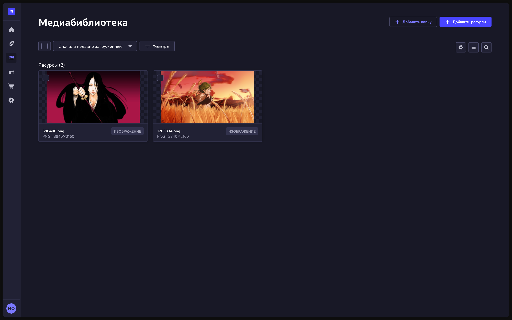
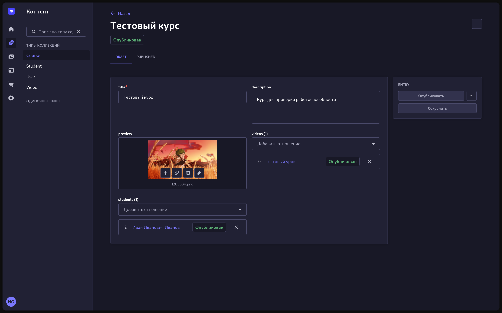

# Инструкция для админ панели StrapiCMS

## 1. Управление контентом

Вкладка `Редактор контента` обозначена иконкой пера.

Внутри вы можете увидеть типы контента (слева) и редактор контента (справа)

Внутри редактора вы можете видеть список записей выбранного типа. Кликнув по записи вы перейдете в редактор и сможете изменить запись.

Чтобы создать новую запись нажмите кнопку `Создать новую запись`. Вы перейдете в пустой редактор.

Внутри редактора, чтобы создать или изменить запись редактируйте поля. Обязательные поля обозначены звездочкой `*`.

Дальше можете нажать `Сохранить` это создаст новые черновик, который позже вы сможете опубликовать. Или нажмите `Опубликовать` тогда запись сразу попадет в приложение.

### Типы контента

#### Курс (Course)

Тип контента отвечающий за курсы. У курса есть название (title), описание (description), превью (preview), список видео (videos), и список студентов (students).

#### Видео/Урок (Video)

Описание видео и приватная ссылка на него. Поля - название (title), описание (description), превью (preview), ссылка (url) - обязательно приватная, порядок (order) - отвечает за порядковый номер курса, курс (course) - курс к которому относится видео

#### Пользователь (User)

Базовый встроенный тип отвечающий за пользователей. Поля - username - логин, email, password - пароль пользователя, confirmed (не используется), blocked (не используется), role - всегда нужно выбирать Authenticated иначе пользователь не будет иметь доступ к приложению, student - соотношение пользователя и его данных как студента

#### Студент (Student)

Содержит информацию о курсах на которые зачислен пользователь, а так же отображаемое имя. Поля - имя (name), курсы (courses), user - соотношение с пользователем.

## Добавление медиа

Чтобы добавить фото для дальнейшего использования как превью видео или курса, нужно зайти в вкладку `Медиабиблиотека` (иконка изображения) и нажать добавить ресурсы.

> Более подробно можно посмотреть в [официальной документации Strapi (EN)](https://docs.strapi.io/cms/features/admin-panel)